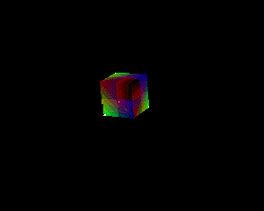
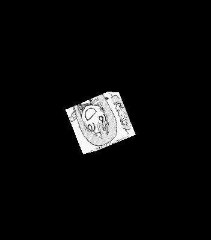
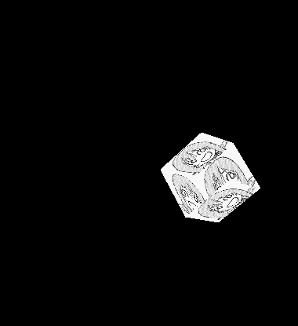
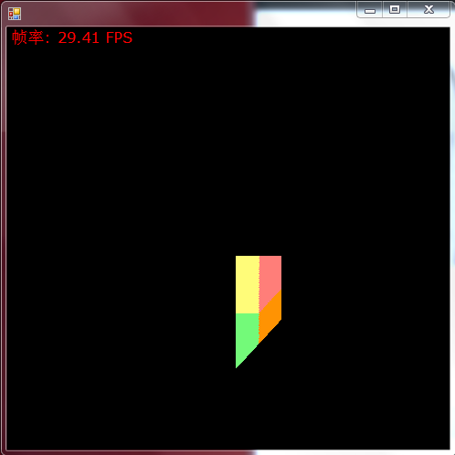
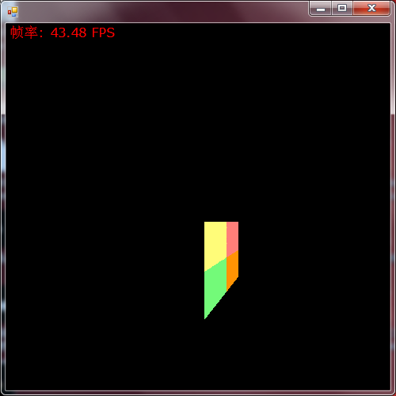
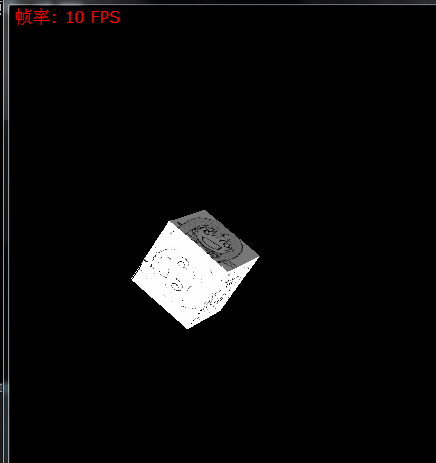

# SoftRender With CSharp（基于C#的软光栅化渲染器）
## 参考资料
> [1] @puppet_master【SoftRenderer&RenderPipeline（从迷你光栅化软渲染器的实现看渲染流水线）】（https://blog.csdn.net/puppet_master/article/details/80317178）  
> [2] @aceyan【SimpleSoftwareRenderer】（https://github.com/aceyan/SimpleSoftwareRenderer）
## 简述
这是一个简易的光栅化渲染器项目，目前已初步实现：

1. 基本图元的光栅化操作，如线段、三角形图元的光栅化
2. 屏幕映射操作，即MVP坐标系变换与CVV(裁剪空间)与NDC(同一设备坐标空间)的转换
3. 深度测试、深度写入
4. 顶点属性插值（如uv插值、顶点颜色插值）以及透视插值矫正
5. 基于Phong光照模型的简单光照

## 演示

1.MVP变换

2.顶点颜色插值

3.uv插值

4.深度测试与深度写入的开启与关闭

左:未开启;   右:开启;

 

5.透视矫正插值的开启与关闭
左:未开启;   右:开启;

 

可以明显感觉到未开启透视矫正插值时,uv的插值是错误的,因为方方正正的贴图贴进去之后角度变得倾斜了.

6.开启漫反射与高光反射

## 一些额外的吐槽
