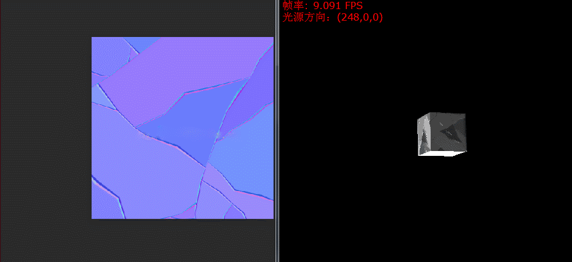

# SoftRender With CSharp（基于C#的软光栅化渲染器）
## 参考资料
> [1] @puppet_master【SoftRenderer&RenderPipeline（从迷你光栅化软渲染器的实现看渲染流水线）】（https://blog.csdn.net/puppet_master/article/details/80317178）  
> [2] @aceyan【SimpleSoftwareRenderer】（https://github.com/aceyan/SimpleSoftwareRenderer）
## 简述
这是一个简易的光栅化渲染器项目，目前已初步实现：

1. 基本图元的光栅化操作，如线段、三角形图元的光栅化
2. 屏幕映射操作，即MVP坐标系变换与CVV(裁剪空间)与NDC(同一设备坐标空间)的转换
3. 深度测试、深度写入
4. 顶点属性插值（如uv插值、顶点颜色插值）以及透视插值矫正
5. 基于Phong光照模型的简单光照

## 演示

1.MVP变换

2.顶点颜色插值

3.uv插值

4.深度测试与深度写入的开启与关闭

左:未开启;   右:开启;

 

5.透视矫正插值的开启与关闭
左:未开启;   右:开启;

 

可以明显感觉到未开启透视矫正插值时,uv的插值是错误的,因为方方正正的贴图贴进去之后角度变得倾斜了.

6.开启漫反射与高光反射

7. 法线映射

## 总结与吐槽

### 疑惑
写这个项目我主要是为了更加深入地学习图形渲染管线的各个细节，之前通过各种图形学的书籍了解到了渲染管线的大致过程（如下所示，参考了《Unity Shader入门精要》的描述）。

    渲染流水线总览（仅为概念分析，实际上每个阶段各自又是一个流水线）：
        CPU阶段 -> 几何阶段 -> 光栅化阶段

    渲染流水线细节：
    CPU阶段：
        加载数据进显存（如顶点数据、纹理等） -> 设置渲染状态（设置顶点/片元着色器、材质等）
                                                |
                                                V
                                            调用Draw Call命令让GPU渲染图元

    几何和光栅化阶段：
        顶点数据 -> 顶点着色器 -> 曲面细分着色器 -> 几何着色器 -> 裁剪 
                                                                |
                                                                V
                  片元着色器  <-  三角形遍历 <-  三角形设置 <-  屏幕映射
                       |
                       V
                 逐片元操作（包含了深度/模板测试）
                  

在反复看《Unity Shader入门精要》第一、四章（即讲渲染流水线和空间变换那两章，讲的特别好），我还是有些地方不是很明白。当时是真的无比迷惑，同时又苦于没有资料可供查询，感觉十分苦闷。我当时的疑惑主要在于以下几点：

1、在纹理映射中，为什么只要给出一张纹理贴图，就能将这个贴图以正确的形式贴在物体身上呢？  

这个问题在给简单的几何图形（如立方体）贴图时问题不太明显。但是在给人型生物进行纹理映射的时候，就会觉得特别神奇了。  

因为对于人型生物的贴图往往看起来奇怪无比，然后我们在写Shader的时候，是根据当前顶点的UV对纹理进行采样的，最后得到都是正确无误的效果。  

当时我就特别想知道，根据UV贴图到底是什么原理呢？（当然啦，后来知道了，也发现我这个问题特别白痴）

2、插值问题。在顶点着色器中的属性（如顶点色、UV、法线等）到底是怎么插值到片元着色器中的呢？它们又是根据什么系数进行插值的呢？  

插值真的是一个很奇妙的东西，只要在顶点着色器上设置一个属性，该属性就能在片元着色器中以插好值的形式存在，这对我来说真的是太神奇了。  

在书里对插值的介绍往往都是用一个数学公式代替，比如值v1插值到v2，插值系数为t，那么从v1到v2这个区间的任何数 V 均可以表示为 V = v1 + (v2 - v1)*t;这个公式倒是比较好懂，但对我来说还是比较抽象。

比如在《Unity Shader入门精要》中，作者用一副图来介绍插值（如下所示，图引用自《Unity Shader入门精要》），而我半天都没搞清楚图中三角形中间的像素到底是怎么根据三个顶点的顶点色进行插值的。

3、何谓线性空间？何谓非线性空间？这是我在看到《Unity Shader入门精要》中讲获取深度法线纹理那一章产生的一个巨大疑惑。

作者在书中解释道，经过透视投影矩阵变化后，在NDC坐标下的深度是非线性的（即不能进行均匀插值），所以不能取出来之后直接用，而是需要转换到视角空间下才能进行正常计算，这对我来说是非常蒙蔽的。

后来经过多方查阅，终于明白这个问题叫做 “透视插值矫正”，那么为什么经过透视变换后，插值就不是线性的呢？透视插值矫正又是怎样的过程呢？中间的数学依据又在哪？

### 寻求答案
在简单的了解了渲染管线后，上面那三个疑问像一座大山一样一直压在我的心里，让我迫不及待地想搞清楚他们。

偶然在知乎上看到[【如何开始用 C++ 写一个光栅化渲染器？】](https://www.zhihu.com/question/24786878)这个问题，发现我的疑惑似乎可以通过编写一个简单的软光栅化渲染器进行解答。

于是便开始了找资料、写代码的过程，写的过程真的特别好玩，最后写完的时候，也终于弄懂啥是uv、怎么插值、为什么透视变换会需要进行透视矫正插值等问题（也可能是浅薄的认知）。

最后，我决定开坑一系列博文，来仔细讲讲光栅化软渲染中的编写思路与流程，顺便巩固一下我在这过程中学到的好多知识。
（比如 
1. 各类矩阵的推导
2. UVN相机模型和欧拉相机模型
3. MVP变换
4. 透视投影带来的插值问题以及为什么正交投影不会有这些问题
5. uv插值应该怎么插
6. 怎么根据uv来对纹理进行采样，从而将一张贴图贴在3D模型的表面
7. 光栅化线段、三角形图元的算法
8. 如何根据一系列顶点，渲染出一个3D模型出来
）

这些都是非常好玩的东西，到时会一一对这些技术进行复习。

